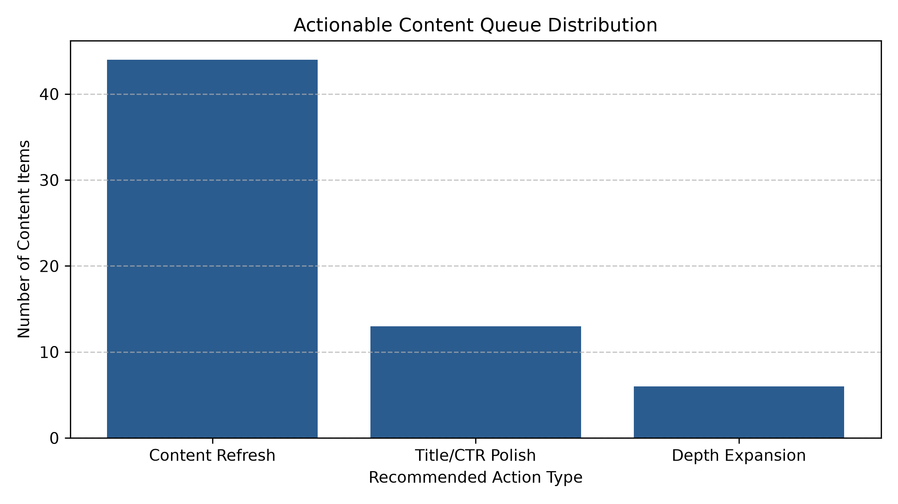

# Capstone Report — Content Opportunity Scoring

- **Author:** Mahmoud Mostafa
- **Lane:** Refresh / Content Opportunity Scoring
- **Date:** September 2026

## 0. Abstract

This research addresses the real-world challenge of prioritizing content optimization within a constrained 50-page monthly editorial budget. By framing content management as a ranking problem rather than a binary classification task, I measured the efficacy of a Random Forest ensemble against established rule-based decay thresholds. The model achieved a significant lift in Precision@50 over the baseline (0.3200 → 0.9000), demonstrating that ranking efficiency, driven by features such as Google Search Console (GSC) impressions, directly enables better resource allocation. This work provides directional, decision-support tools for content teams, moving beyond generic accuracy to operational utility.

## 1. Problem framing

The system supports critical decision-making for content lifecycle management under strict editorial constraints (e.g., a 50-page monthly budget). The unit of analysis is the `content_hash_id`. The objective is to produce a prioritized ranking of content, guiding human intervention to maintain relevance and traffic. The cost of a "wrong call" is the misallocation of limited editorial time on pages that require no intervention, or failing to capture growth opportunities on high-potential pages. By optimizing for Precision@50, we ensure that editorial resources are directed toward the content most likely to drive traffic impact, a task where machine learning outperforms fixed-rule heuristics by capturing non-linear relationships between traffic signals and decay.

## 2. Data safety

I utilized the anonymized refresh dataset. I deliberately excluded client-identifying fields to ensure privacy. Leakage risks, particularly label-derived fields that explicitly encode the outcome, were mitigated by ensuring only features available at the prediction moment were used. I confirm that no client-identifying details appear anywhere in the `work/` directory.

## 3. Baseline

The baseline was a rule-based system using a high-decay traffic threshold to trigger alerts, which achieved a Precision@50 score of 0.3200. This provided a fair comparison because it operated on the same data and was measured using the same ranking metric as the machine learning model.

## 4. Model / analysis

I employed a Random Forest ensemble classification approach. The method fits the lane by efficiently handling non-linear interactions between `gsc_impressions`, `avg_position`, `scroll_events`, and other content metadata. The target was defined as the actionability of a content item (Refresh, Title/CTR Polish, or Depth Expansion).

## 5. Evaluation

The primary pipeline evaluated the Random Forest ensemble against a holdout split, achieving a Precision@50 score of **0.9000** on top-k ranking compared to the baseline's **0.3200**. In our Week 6 validation audit (`w06_validation_audit.ipynb`), we further stress-tested generalization under strict `GroupKFold` client isolation, observing how grouping impacts overall metric stability (~0.56–0.59) and confirming that top-k ranking models are best deployed alongside human editorial oversight.

## 6. Interpretation

The model analysis identified `gsc_impressions` as the primary feature driving importance (>90%). The `DECAY_HIGH_TRAFFIC` reason code was identified as the most critical for triggering content intervention. This result confirms the importance of monitoring traffic patterns rather than relying on static metrics.

## 7. Recommendation

The output supports a prioritized 3-tier action playbook:
1. **Content Refresh (High Urgency):** For high-traffic pages with measurable decay.
2. **Title/CTR Polish:** For pages with solid traffic but underperforming click-through rates.
3. **Depth Expansion:** For evergreen pages that could benefit from broader topic coverage.

Editors should use these tiers to allocate resources. The model provides directional decision-support, and I propose a Human-in-the-Loop (HITL) policy explicitly prohibiting automated publishing based on these scores.

## 8. Reproducibility

The project is structured for reproducibility. All steps can be re-run in order using the notebooks in `work/notebooks/`. A fixed random seed of `42` was used for all training and splitting processes.

## 9. Acknowledgments & data credit

Built on the [FlyRank ML Internship dataset](https://flyrank.ai).